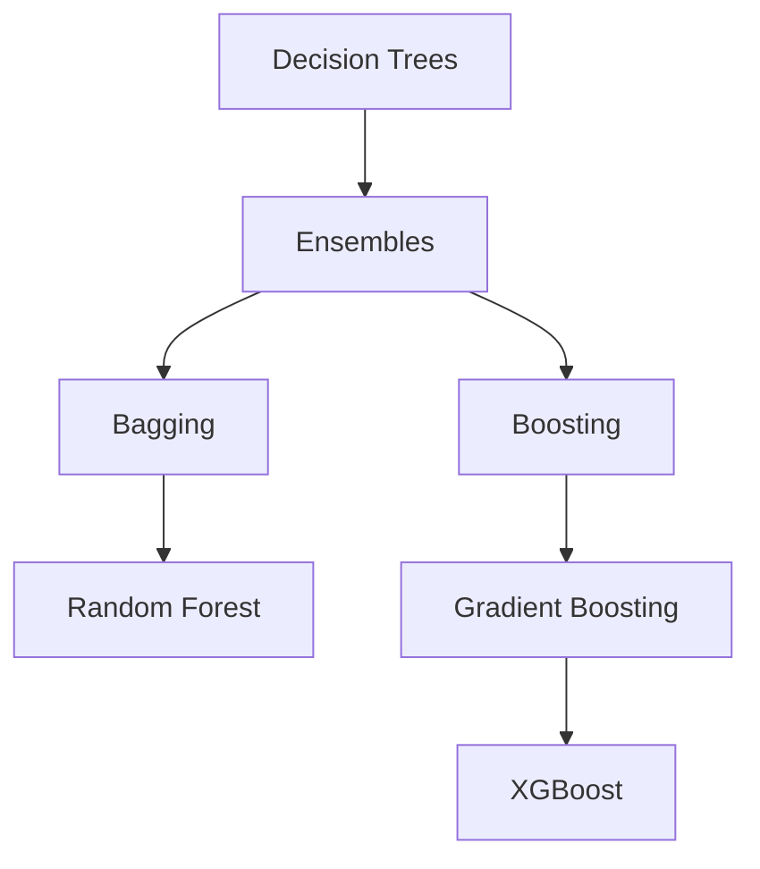
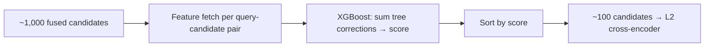

# From Decision Trees to XGBoost, and Why It's the L1 Ranker

This is a companion piece to [Designing a Job Candidate Retrieval System](/articles/designing-a-job-candidate-retrieval-system). That article treats the L1 reranking stage — the tree model that cuts ~1,000 fused candidates down to ~100 — as a given: "use LightGBM or XGBoost." This article backs up and explains the whole lineage those models come from, then closes the loop on why a boosted tree ends up being the right tool for that exact job.

## 1. A decision tree is one learned if/else system

A decision tree takes one tabular row of features and repeatedly asks yes/no questions until it hits a leaf:

```text
experience > 5?
├─ yes → similarity > 0.8?
│        ├─ yes → leaf A
│        └─ no  → leaf B
└─ no → leaf C
```

For **regression**, a leaf stores a number — typically the mean of the training targets that landed there. If a leaf collects training rows with targets `70, 80, 75, 77`, it stores $75.5$, and any new row that reaches that leaf gets predicted $75.5$.

For **classification**, a leaf stores class counts. A leaf with `8 cats, 2 dogs` gives $P(\text{cat}) = 0.8$.

So: `features → tree path → leaf → number or probability`. One tree can back either a regression or a classification objective — the split is in how it was trained, not in the tree structure itself.

The problem: a single tree is **high variance**. A small change in the training data can send it down completely different splits. That instability is what motivates everything below.

## 2. Ensembles: combine many models

An ensemble combines many models into one stronger prediction. There are two fundamentally different ways to do that:



Random Forest does **not** turn into XGBoost as you improve it — they're siblings from different branches. Random Forest comes from bagging; XGBoost comes from boosting. Confusing the two directions is the single most common mental-model mistake here.

## 3. Bagging: train independently, then average

Bagging trains many models **independently** on randomized versions of the data, then combines their outputs — average for regression, vote (or averaged probabilities) for classification:

```text
Tree 1 → 70          Tree 1 → cat
Tree 2 → 80    avg    Tree 2 → cat    vote
Tree 3 → 75   ───→ 75 Tree 3 → dog   ───→ cat
```

The goal is purely to **reduce variance**. If each tree's errors are somewhat independent — one overreacts to a weird training row, another reacts differently — averaging smooths those errors out without needing any single tree to be individually accurate.

**Random Forest** is bagging applied to decision trees, plus one more source of randomness: each tree gets a bootstrap sample of rows *and* only considers a random subset of features at each split. The feature subsampling matters specifically because if one feature is very strong, every tree would otherwise pick the same splits and end up correlated — correlated trees don't help each other when you average them. Forcing diversity is what makes the ensemble effect real.

## 4. Boosting: train sequentially, correct mistakes

Boosting trains models **sequentially**, where each new model is trained specifically to fix what the current ensemble still gets wrong:

```text
Model 1
  ↓ look at what's still wrong
Model 2 corrects it
  ↓ look at remaining error
Model 3 corrects more
```

$$
\boxed{\text{Bagging = parallel + average}} \qquad \boxed{\text{Boosting = sequential + corrections}}
$$

**Gradient boosting** is a specific way of deciding what "correct the mistakes" means: it uses the gradient of the loss function to determine which direction the current prediction should move, then trains a new tree to approximate that correction.

```text
initial prediction = 50
Tree 1 correction   = +10
Tree 2 correction   = -3
Tree 3 correction   = +5
final                = 50 + 10 - 3 + 5 = 62
```

Formally, each round adds a new function rather than updating a parameter vector:

$$
F_{t+1}(x) = F_t(x) + \eta \, T_t(x)
$$

where $T_t$ is the new tree and $\eta$ is the learning rate — the same role $\eta$ plays in ordinary gradient descent, $\theta \leftarrow \theta - \eta \nabla L$, just applied to a sequence of trees instead of a weight vector.

Boosting is the umbrella strategy; gradient boosting is one implementation of it (AdaBoost is another). **XGBoost** is a highly optimized, regularized implementation of gradient-boosted trees: it adds L1/L2 regularization on leaf weights, uses second-order gradient information (not just the gradient but the Hessian) to choose splits more precisely, handles missing values natively, and subsamples rows and features per tree the way a random forest does — borrowing bagging's variance-reduction trick inside a boosting framework.

### How XGBoost actually outputs a number or a category

Each tree contributes a numeric adjustment, and the final prediction is a sum:

```text
base score = 0.4
Tree 1     = +0.3
Tree 2     = -0.1
Tree 3     = +0.2
raw score  = 0.4 + 0.3 - 0.1 + 0.2 = 0.8
```

For regression, that raw score can be the prediction directly. For binary classification, the summed score is treated as a logit and passed through a sigmoid:

$$
P(y=1) = \frac{1}{1 + e^{-z}}, \quad z = 2 \implies P \approx 0.88
$$

For multiclass, each class gets its own summed score and softmax converts the vector into probabilities. So the same underlying mechanism — sum tree contributions — backs regression scores, binary probabilities, and multiclass probabilities; the objective function you train with decides which one you get.

## 5. Bagging vs boosting: when to reach for which

| | Random Forest (bagging) | XGBoost (boosting) |
|---|---|---|
| Trees trained | Independently | Sequentially |
| Reduces | Variance | Bias (while controlling variance) |
| Parallelizable | Very easily | Less so |
| Hyperparameter sensitivity | Low | Higher — can overfit with too many/deep trees or too high a learning rate |
| Best for | A robust baseline, fast to build, hard to overfit badly | Squeezing out maximum accuracy on structured tabular data |

Trees are a strong inductive bias for tabular data generally — thresholds, nonlinear interactions, mixed feature scales, and missing values all fall out naturally without heavy preprocessing. Boosting layers many small trees to capture increasingly subtle versions of a rule like "if `years_experience > 5` and `title_match > 0.8` and `location_match = true`, then high relevance" — exactly the shape of rule an L1 candidate ranker needs to learn.

## 6. Where this lands: XGBoost as the L1 ranker

Back to the retrieval funnel. By the time candidates reach L1, they're already a fused top-k list (~1,000 candidates) out of RRF over full-text and ANN search — see [Designing a Job Candidate Retrieval System](/articles/designing-a-job-candidate-retrieval-system). L1's job is to cut that down to ~100 using a model that's cheap enough to run on every candidate but smart enough to actually improve the ordering.



**Feature fetch.** For every `(query, candidate)` pair, pull a fixed feature vector — this is the step that makes L1 "cheap" relative to a cross-encoder, since it's mostly lookups and arithmetic, not a fresh model forward pass:

```text
- BM25 / full-text score            (from stage 1 retrieval)
- embedding cosine similarity        (from stage 2 retrieval)
- years_experience - required_years  (structured delta)
- title/seniority match              (categorical → encoded)
- recency of candidate's last activity
- historical response rate for similar past reqs
- location match (boolean)
```

Note that several of these features are **already computed** by the retrieval stages — the BM25 score and embedding similarity aren't recomputed, they're just carried forward as features. This is exactly why a separate biencoder pass at L1 is usually redundant: the similarity signal already exists, and folding it in as one feature among several lets the tree model learn how much to trust it relative to everything else, rather than trusting it blindly.

**Training signals.** The model is trained on historical `(query, candidate, features) → label` triples, where labels come from what recruiters actually did:

```text
shortlisted    → positive
hired          → strong positive
viewed, passed → weak negative
rejected       → negative
never surfaced in top-k → not used (no signal either way)
```

This is naturally framed as **learning to rank**: XGBoost supports pairwise and listwise ranking objectives (`rank:pairwise`, `rank:ndcg`) that directly optimize ordering within a query's candidate list, rather than treating each candidate's score independently the way plain regression or classification would. That matters here because what you actually care about is *relative* order — is candidate A more relevant than candidate B for this req — not the absolute value of either score.

**Why XGBoost specifically, for this stage.** Three properties line up with what L1 needs:

- **Speed at inference.** Summing a few hundred shallow trees per candidate is fast enough to run on 1,000 candidates per query within a tight latency budget — a cross-encoder forward pass is not.
- **Heterogeneous, sparse, tabular features.** BM25 scores, cosine similarities, categorical seniority levels, and booleans all live on wildly different scales; trees split on thresholds per-feature and don't need any of that normalized.
- **Fast retraining on feedback.** Recruiter shortlist/reject signal accumulates continuously. Retraining a few hundred trees on updated labels is cheap compared to fine-tuning a cross-encoder, which keeps the L1 stage responsive to recent behavior rather than stale for months.

A random forest would work here too — same feature story, same cheap inference — but boosting's bias-reduction usually wins on ranking quality once there's enough labeled data to support it without overfitting, which is why XGBoost (or LightGBM, its faster cousin) is the more common default for this exact stage in practice.

## The one-line summary

$$
\boxed{\text{Random Forest = bagging}} \qquad \boxed{\text{XGBoost = gradient boosting}}
$$

Both map `tabular features → prediction`. In a candidate retrieval system, that mapping is precisely the L1 stage: take everything the funnel already knows about a candidate, fetch it as features, and use a boosted-tree ranking objective to decide who's worth the L2 cross-encoder's much more expensive attention.
