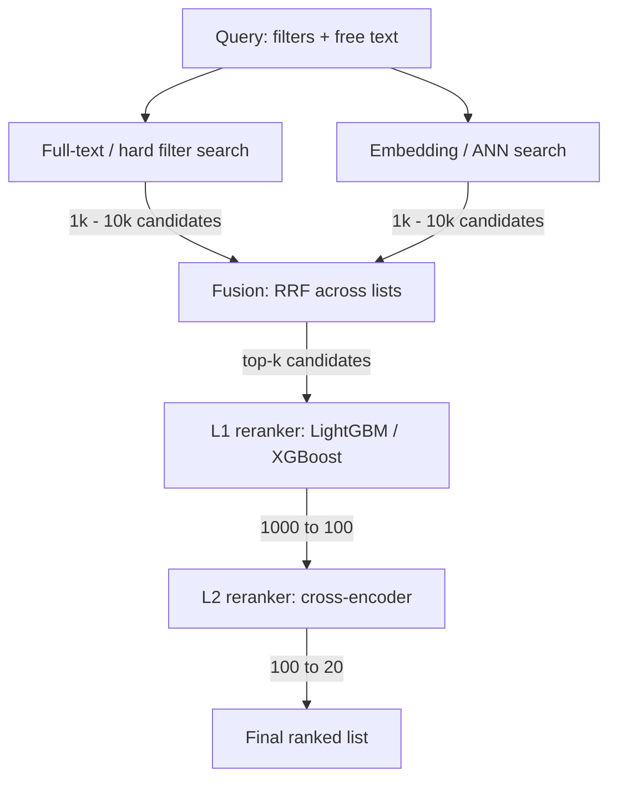

# Designing a Job Candidate Retrieval System

This is a working design doc, not a finished blueprint — I'm going to lay out a first-pass pipeline for matching job candidates to a query (a job req, a recruiter search, a "find me more like this") and iterate on it over time. Each stage below is a knob: there are cheaper and more expensive versions of every step, and the right choice depends on corpus size, latency budget, and how much labeled feedback you have to train on.

## The shape of the problem

You have a pool of candidates — anywhere from tens of thousands to tens of millions — and a query (structured filters + free text, or a reference job description). You need to return a small, well-ordered list of the most relevant candidates, fast, and you need the ranking to keep improving as you collect feedback (recruiter clicks, shortlists, rejections).

The standard answer to "rank well over a huge corpus, cheaply" is a **funnel**: each stage narrows the candidate set and gets progressively more expensive per candidate, so you only spend the expensive compute on documents that survived the cheap filters.



## Stage 1 & 2: candidate generation

The first two stages run **in parallel** and both operate over the full corpus. Their only job is recall: don't lose good candidates, and don't be too slow doing it.

**Hard filters over full text.** Elasticsearch or Postgres full-text search (`tsvector`/`tsquery`) applied to structured and semi-structured fields — title, required skills, location, years of experience, work authorization. This is where non-negotiable filters live: if a req requires a security clearance, that's a hard filter here, not a ranking signal downstream. Output: 1,000–10,000 candidates.

**Embedding / ANN search.** The same query embedded and matched against candidate embeddings (resume embeddings, skills embeddings) via pgvector or Elasticsearch's kNN/HNSW support — see [Approximate Nearest Neighbor (ANN)](/notes/approximate-nearest-neighbor) for how that search actually works under the hood. This catches semantic matches full-text search misses — "ML engineer" matching a resume that says "built recommendation models in PyTorch" without ever using the phrase "machine learning." Output: 1,000–10,000 candidates.

Both stages are cheap **per candidate** — that's the point. Full-text search and ANN search are both sublinear in corpus size, so they're the only stages that can economically scan the entire pool.

## Stage 3: fusion

You now have two ranked lists over overlapping candidate sets, on incomparable scales (a BM25 score and a cosine similarity don't mean the same thing). Fusing them into a single ordering is exactly the problem [Hybrid Fusion (RRF)](/notes/hybrid-fusion) solves — it uses rank position instead of raw score, so a candidate that shows up reasonably high in *both* lists outranks one that's #1 in only one list.

```text
RRF(d) = Σ 1 / (k + rank_l(d))   over each list l, k ≈ 60
```

Computing this over the union of both lists is a top-k merge — a min-heap over the heads of both lists gives you the fused top-k without fully sorting either input. A candidate present in only one list still scores, just lower; a candidate that never appears in either list is implicitly filtered out — "not retrieved by anything" is itself a signal.

**Open question I'll revisit:** is plain RRF good enough, or does it deserve to be a *learned* fusion (e.g. a small logistic regression over rank position + raw score from each retriever, trained on click/shortlist data)? RRF is a fine unweighted default; a learned fusion is the natural v2 once there's enough labeled data to justify it.

## Stage 4: is that it?

No — a fused top-k list (say, 1,000 candidates) is still too coarse and too cheap a signal to hand to a recruiter or a downstream product surface. It was produced by retrieval systems optimized for recall, not precision, and it hasn't seen any candidate-specific features beyond text/embedding match (experience level, recency of activity, past outcomes with similar reqs). That's what the reranking stages are for.

## Stage 5: L1 reranking (cheap, tree-based)

This stage takes the ~1,000 fused candidates and cuts them to ~100 using a gradient-boosted tree model (LightGBM or XGBoost) — see [Random Forest vs XGBoost](/notes/random-forest-vs-xgboost) for how these actually work and why boosted trees are the standard choice here over a random forest.

The model doesn't re-embed anything or do a fresh similarity computation — it's a **feature-based** reranker:

```text
1. feature fetch per (query, candidate) pair:
     - BM25 / full-text score
     - embedding cosine similarity
     - years of experience delta from req
     - recency of last activity
     - historical response rate for similar reqs
     - title/seniority match
2. model.predict(features) -> relevance score
3. sort by score, take top 100
```

This is "cheap" only relative to what comes next — a cross-encoder. It's still a real model with real features, and it's the stage most directly trainable from recruiter feedback (shortlisted / rejected / hired), since tree models handle sparse, heterogeneous, mostly-tabular features well and retrain fast.

**Open question:** is a biencoder useful here at all, given the embedding similarity feature already came out of stage 2? Probably not as a separate model — folding the existing similarity score in as one feature among many is simpler and just as effective; a second embedding pass would be redundant unless it's a *different* embedding space (e.g. a bi-encoder fine-tuned specifically on recruiter feedback rather than general semantic similarity).

## Stage 6: L2 reranking (expensive, cross-encoder)

The final ~100 candidates go through a cross-encoder: a model that takes `(query, candidate)` as a single joint input and outputs a relevance score directly, rather than comparing two independently-computed embeddings.

```text
score = cross_encoder(query_text, candidate_text) -> [0, 1]
```

Cross-encoders are far more expensive per pair than a biencoder — no candidate embedding can be precomputed and cached, since the model needs both texts together — which is exactly why it only runs on the 100 survivors instead of the full corpus. Output: top ~20, the list a recruiter actually sees.

## What's still open

- **Fusion**: unweighted RRF vs. a learned fusion once there's labeled data.
- **L1 features**: what's the minimum viable feature set, and how much does a historical-outcomes feature (did a similar candidate get hired for a similar req) actually move the needle vs. overfitting to past bias?
- **L2 model choice**: off-the-shelf cross-encoder vs. fine-tuned on recruiter shortlist/reject labels — and how to get enough labels to make fine-tuning worthwhile.
- **Feedback loop**: how do shortlists/rejections/hires flow back into retraining L1 (straightforward) and eventually into fusion weights and even the embedding model itself (much less straightforward)?

I'll pick one of these up in the next pass.
